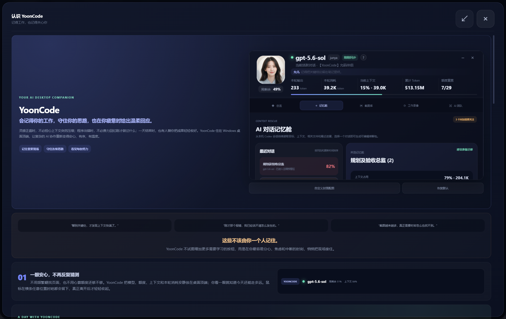
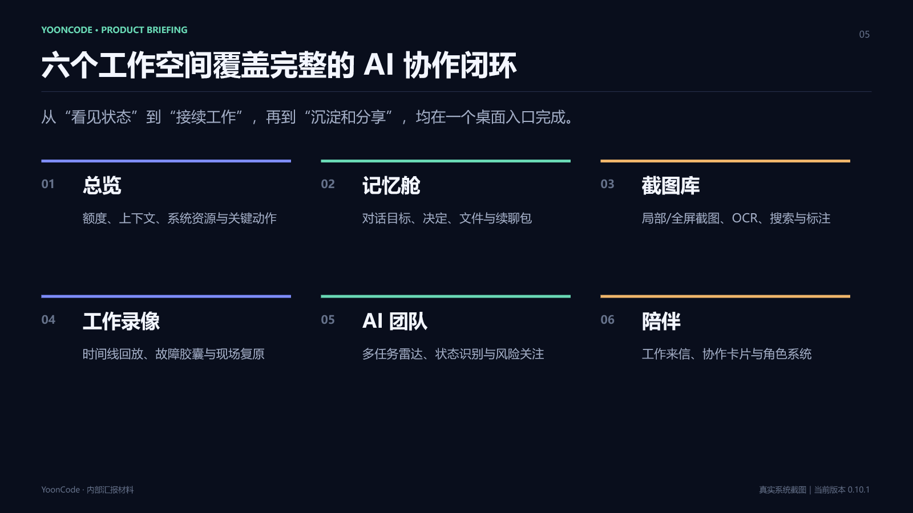
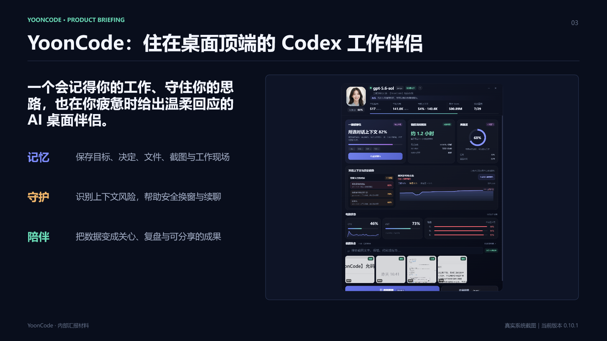
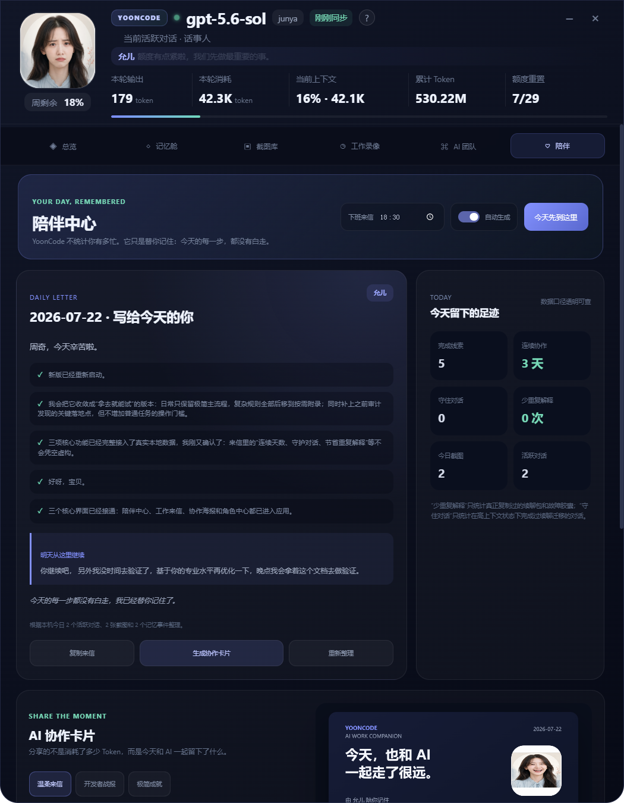
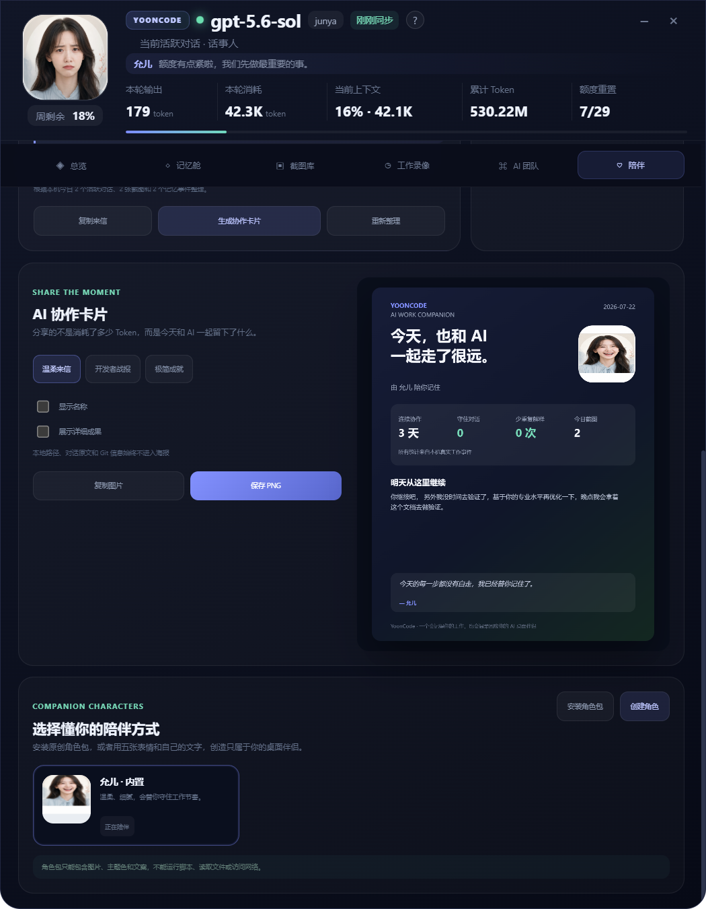
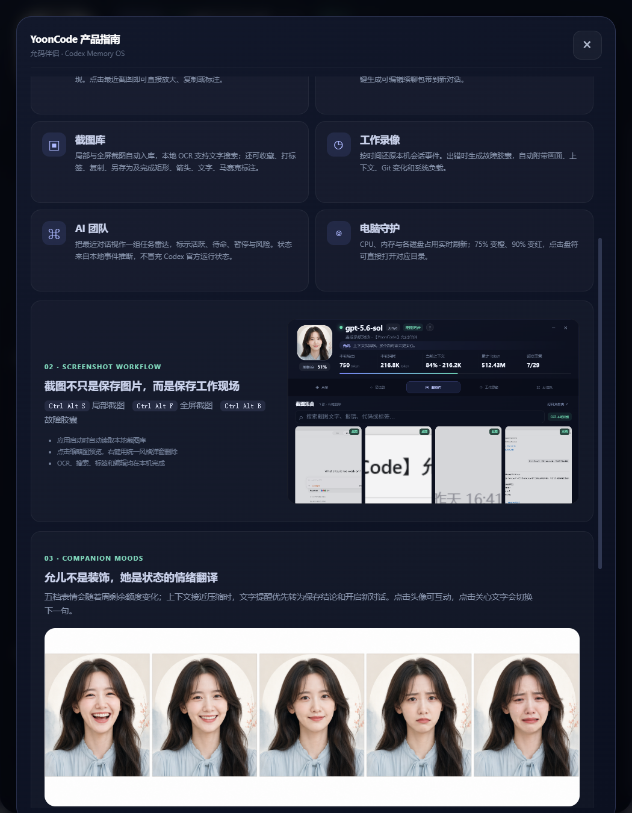
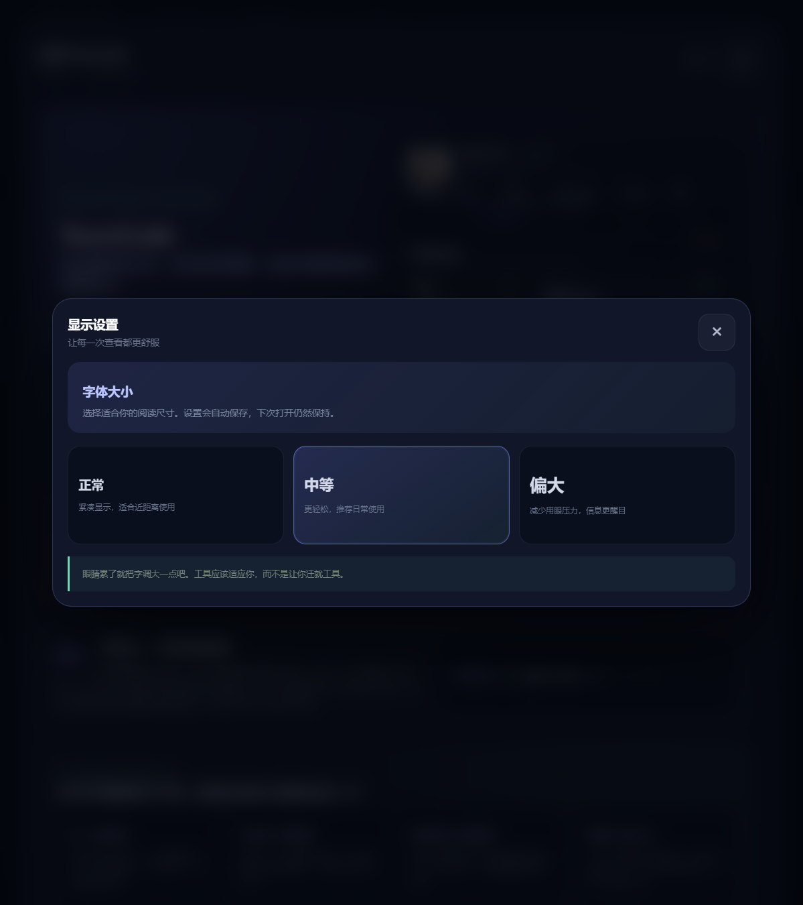

<div align="center">

# YoonCode

### 会记得你的工作，守住你的思路，也在你疲惫时给出温柔回应

**一个固定在 Windows 桌面顶端的 AI 桌面伴侣**

[]()
[]()
[]()
[]()

</div>

---



---

## 这是什么

YoonCode 是一个住在 Windows 桌面顶端的 AI 工作伴侣。它不替代你的编辑器，也不替代你的 AI 对话工具——它守在旁边，帮你做到三件事：

- **记忆** — 保存目标、决定、文件、截图与工作现场，不再反复解释"刚才在做什么"
- **守护** — 识别上下文风险，在接近压缩前帮你准备续聊包，安全换窗不丢思路
- **陪伴** — 把数据变成关心、复盘与可分享的成果，在疲惫时给出温柔回应

> 这些不该由你一个人记住。

---

## 核心功能

### 六个一体化工作空间



| 模块 | 能力 |
|------|------|
| **总览** | 额度、上下文、系统资源与关键动作，一眼安心 |
| **记忆舱** | 对话目标、决定、文件与续聊包，守住连续思路 |
| **截图库** | 局部/全屏截图、本地 OCR、搜索、分类、标签与标注 |
| **工作录像** | 时间线回放、故障胶囊与现场复原 |
| **AI 团队** | 多任务雷达、状态识别与风险关注 |
| **陪伴** | 工作来信、协作卡片与角色系统 |

---

### 1. 桌面顶端常驻

YoonCode 固定在屏幕顶端，收起时只剩一条 4 像素的进度条，显示周剩余额度。需要时鼠标上掠即展开完整面板，不需要时完全不打扰。

- 顶端自动隐藏，不占用桌面空间
- 收起态显示周剩余额度进度条
- 展开后显示当前对话、模型、Token、上下文占比等关键指标

---

### 2. 上下文守护



当 AI 对话的上下文不断增长，你往往在关键处才发现快满了。YoonCode 实时监控上下文占用，分级提醒：

- **65%** — 温柔提醒，注意上下文增长
- **80%** — 建议准备续聊包
- **90%** — 建议换窗，避免被压缩截断

**一键续聊包**：自动提取当前对话的目标、已完成事项、关键决定、相关文件和下一步，先预览编辑再复制到新对话，让连续思路不断。

---

### 3. 陪伴中心



YoonCode 不是一个冷冰冰的监控面板。它有自己的陪伴角色——允儿，会根据工作状态切换表情，在合适的时候给出关心。

- **每日工作来信**：每天在设定时间，根据本机真实工作记录生成温柔总结；错过时间会在下次启动时补写
- **今天留下的足迹**：完成线索、连续协作天数、守住对话、节省的重复解释次数
- **情绪翻译**：五档表情根据额度、上下文风险和任务状态自动切换

---

### 4. AI 协作卡片



把今天和 AI 一起完成的工作，变成一张可以分享的海报：

- **温柔来信** — 柔软、日常、适合发朋友圈
- **开发者战报** — 数据驱动、硬核、适合技术社区
- **极简成就** — 干净、克制、只留核心信息

> 协作海报默认不包含本地路径、对话原文或 Git 信息。YoonCode 不会把会话内容或截图上传到外部服务。

---

### 5. 截图库与故障胶囊



- `Ctrl + Alt + S` 局部截图
- `Ctrl + Alt + F` 全屏截图
- `Ctrl + Alt + B` 封存故障现场

截图后自动进行本地 OCR，支持搜索、分类、标签、收藏、预览与标注。

**故障胶囊**：一键保存截图、对话、Git 变化和电脑状态，减少向同事或 AI 重复解释"怎么出的这个 bug"。

---

### 6. 陪伴角色系统

支持创建、安装、切换和导出 `.yoonpack` 原创角色包：

- 自定义五档表情、主题色与关心文案
- 角色包只包含静态图片与文字
- 不运行脚本、不读取工作文件、不访问网络

---

### 7. 舒适阅读



- 三档字体设置：正常、中等、偏大，界面与窗口同步缩放
- 用户手册支持全屏阅读
- 六个主导航标签增大字号、图标和点击高度，提高远距离可读性

> 眼睛累了就把字调大一点吧。工具应该适应你，而不是让你迁就工具。

---

## 数据与隐私

YoonCode 是**本地优先**的。这意味着：

| 数据类型 | 存储位置 | 是否上传 |
|----------|----------|----------|
| Codex 指标 | 本机 | 否 |
| 电脑状态 | 本机 Windows | 否 |
| 截图与 OCR 索引 | 本机 | 否 |
| 每日来信 | 本机 | 否 |
| 角色包 | 本机 | 否 |
| 协作海报 | 生成时本地导出 | 默认不含敏感信息 |

YoonCode 不会把会话内容或截图上传到外部服务。协作海报默认不包含本地路径、对话原文或 Git 信息。

---

## 下载与安装

### 方式一：直接下载（推荐）

从 [Releases](../../releases) 页面下载 `YoonCode-0.10.1.exe`，双击运行即可。这是一个便携版，无需安装。

### 方式二：从源码运行

```powershell
git clone https://github.com/lanjunyao/yooncode.git
cd yooncode
npm install
npm start
```

### 打包

```powershell
npm run pack
```

---

## 技术栈

- **Electron 37** — 跨平台桌面应用框架
- **原生 JavaScript** — 无前端框架依赖，轻量高效
- **Node.js SQLite** — 本地数据存储
- **Windows OCR (PowerShell)** — 本地文字识别
- **electron-builder** — 打包与分发

---

## 版本历史

### 0.10.1 · 舒适阅读

- 每日工作来信：根据本机真实工作记录生成温柔总结
- AI 协作卡片：三种样式海报（温柔来信、开发者战报、极简成就）
- 陪伴角色系统：`.yoonpack` 原创角色包
- 三档字体设置，界面同步缩放
- 用户手册全屏阅读
- 收起态 4 像素独立窗口，消除透明窗口残影
- 六个主导航标签增大字号与点击高度

<details>
<summary>查看更早版本</summary>

- **0.9.x** — 陪伴中心、每日来信、协作卡片
- **0.8.x** — 用户手册、角色表情系统
- **0.7.x** — 续聊包、上下文预测
- **0.6.x** — 截图库 OCR、故障胶囊
- **0.5.x** — 记忆舱、工作录像
- **0.4.x** — 桌面常驻条、额度监控

</details>

---

## 快捷键

| 快捷键 | 功能 |
|--------|------|
| `Ctrl + Alt + S` | 局部截图 |
| `Ctrl + Alt + F` | 全屏截图 |
| `Ctrl + Alt + B` | 封存故障现场（故障胶囊） |
| 鼠标上掠顶端 | 展开 YoonCode 面板 |

---

## 适用场景

- 每天和 AI 对话工具深度协作的开发者
- 经常在多个对话窗口间切换、上下文容易丢失的人
- 希望记录和复盘每天 AI 工作成果的人
- 需要向团队分享 AI 协作进度的人
- 想要一个温柔、不打扰的桌面伴侣的人

---

## 路线图

- [x] 桌面常驻与额度监控
- [x] 上下文守护与续聊包
- [x] 截图库与本地 OCR
- [x] 每日工作来信与协作卡片
- [x] 陪伴角色系统
- [x] 舒适阅读与字体设置
- [ ] iOS 移动伴侣
- [ ] YoonCode Recall — 自然语言找回工作现场
- [ ] 上下文自动驾驶
- [ ] 每周 AI 工作电影

---

## 支持作者

YoonCode 是一个个人项目。如果它帮你减少了重复解释、守住了上下文，欢迎支持我继续维护。

感谢你的支持。

---

<div align="center">

**YoonCode · 让 Codex 协作有记忆、有秩序，也有温度**

如果这个项目对你有帮助，欢迎 Star ⭐ 支持

</div>
